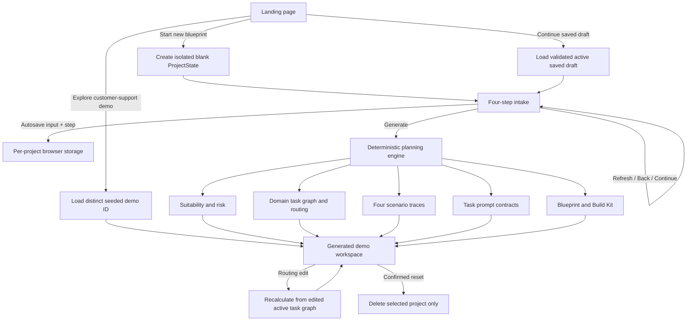

# BuildWise Generalisation Remediation Report

## Scope and verified baseline

- Repository: `amit1858/buildwise-ai-value-architect`
- Verified `origin/main`: `6994bb17cb2b42a62f3e6c38f05e2eae652dce57`
- Investigation baseline: the worktree was clean and its `HEAD` matched the verified commit.
- Next.js version: `16.3.4`

## Confirmed root causes

### 1. “Start new blueprint” was not blank

`components/intake/ProjectIntake.tsx` initialized `EMPTY_FORM` by calling
`getDefaultProjectInput()`. In `lib/buildwise.ts`, that function returned the complete
customer-support demonstration, including its project name, problem, users, volume,
documents, risk posture, providers, and sample input. The new-project route therefore
rendered demo data by design; this was not caused by the browser URL.

### 2. Intake drafts were globally shared

`ProjectIntake` persisted every intake to one unversioned key,
`buildwise-intake-draft`. The key contained neither a project ID nor an origin marker.
Opening another “new” project merged the global draft over the seeded support object.
This permitted blank, demo, and unrelated draft values to contaminate one another.

### 3. Restore precedence hid corrupt or obsolete state

The intake initializer caught every parse error and silently returned the seeded
`EMPTY_FORM`. `lib/project-store.ts` likewise caught all storage errors and returned an
empty project array. Invalid state was therefore indistinguishable from no state, and
the UI presented a success-shaped fallback instead of a visible recovery choice.

### 4. Demo selection could open an unrelated project

`ensureSeedProject()` returned `projects[0]` whenever any saved project existed. Both
“Explore demo” and “Open workspace” called this helper. The demo CTA could therefore
open the first arbitrary draft, and the generic workspace action could silently select
or create the customer-support demo.

### 5. Workspace hydration silently recreated the demo

`WorkspaceShell` loaded the requested ID from storage and, when that lookup failed,
reconstructed `buildDemoProject()` for the special demo ID. That fallback bypassed the
project store and migration/validation, hid missing or invalid persisted state, and
made a URL appear to be a valid project source.

### 6. Project persistence had no contract or isolation metadata

`lib/project-store.ts` stored a raw `Project[]` under `buildwise-projects`. There was no
schema version, active-project record, project-origin discriminator, migration result,
draft/generated distinction, or per-project storage key. IDs were timestamp-based and
active-project selection was implicit. Reset rewrote the whole collection and seeded a
demo, so it could not clear only the selected project.

### 7. Autosave timing and navigation were conflated with creation

The intake saved the entire form immediately after each render-changing edit, but it
did not persist step position, project identity, or a saved-at value. Final submission
created a new ID, removed the one global draft, and navigated. Refresh restored only the
merged form, not the exact intake session or step. Autosave itself did not call router
navigation; the apparent refresh/loss came from unscoped restore precedence and form
initialization, not from the storage write.

### 8. General-purpose generation was customer-support templating

`makeWorkflowTasks()` always emitted case triage, support-message extraction, policy
retrieval, customer response generation, and escalation validation. Scenario policies
identified tasks by support-specific IDs such as `triage`, `policy`, `draft`, and
`validate`. Prompt placeholders were fixed to `customer_message`, `policy_context`, and
`account_metadata`. Workload reasoning, human escalation, task descriptions, and
artifacts repeated customer, account, billing, and policy language for every project.
Changing the intake mostly changed labels and numeric scale; it did not produce a
different architecture.

### 9. Suitability could not reject broad generative AI

Suitability was inferred in the workspace from quality sensitivity and the count of
hard-coded tasks. The project contract had no suitability result. The engine could not
represent “primarily deterministic” or “unsuitable pending data/controls”, so payroll
calculation and regulated decisions were forced through the same model-centric
workflow.

### 10. Workload units were strings rather than auditable assumptions

Typical input and output sizes were free-form strings. P95 input, input/output units,
attachment size/pages, turns, retrieved passages, tokens per passage, reusable context,
peak multiplier, and target response time were absent or conflated. The calculation
engine therefore used task-template token constants rather than transparent conversions
from the active intake. Business executions and derived model calls were displayed near
one another without a durable derivation contract.

### 11. Routing edits did not rebuild from the edited task graph

`recalculateProjectFromTasks()` rebuilt scenarios from a newly generated task set and
then replaced only the visible `tasks` array. As a result, edited routing assumptions
could be displayed while scenario economics still reflected regenerated defaults.
Prompt regeneration only copied edited task names, not edited execution assumptions.

### 12. Artifact templates contained universal support assumptions

`lib/build-artifacts.ts` embedded policy retrieval, customer/account/billing decisions,
and a fixed hybrid recommendation in cross-domain exports. Artifact provenance was
derived from a `demoMode` boolean rather than a project-origin/state contract.
Consequently non-support exports could contain foreign support terminology.

### 13. Public-mode execution crossed an unnecessary adapter boundary

The public demo called `executeProviderTest()` in the browser for simulation and the
standalone path called `/api/providers/test`. Although the public branch did not fetch
the route, public behavior was coupled to a provider adapter rather than an explicitly
deterministic local simulation contract. The UI also lacked project-origin-aware
provenance.

### 14. Buttons relied on implicit HTML defaults

Many workspace controls omitted `type="button"`. They were not currently nested in a
form, so they did not explain the intake refresh defect, but the omission made future
composition unsafe and violated the requirement that non-submit controls never submit
a surrounding form.

## URL, base path, and static routing conclusion

The repository config sets `basePath` to `/buildwise-ai-value-architect`,
`assetPrefix` to the same value plus `/`, and `trailingSlash: true` only when
`PUBLIC_DEMO=true`.

The bundled Next.js 16.3.4 documentation establishes:

- `basePath` is compiled into client bundles and is automatically applied by
  `next/link` and Next router navigation.
- `assetPrefix` is intended for CDN-hosted `/_next/static` assets and is explicitly not
  the recommended mechanism for deploying an application under a sub-path.
- `assetPrefix` does not rewrite files in `public`; those URLs must be authored with an
  appropriate path.
- `trailingSlash: true` emits route directories with `index.html` in static export.
- static dynamic routes require `generateStaticParams()`.
- browser storage must be accessed in client-only execution such as effects or guarded
  initializers.

**Conclusion:** URL/basePath did not cause the seeded intake, mixed draft, or demo
fallback. Those failures are fully explained by the application state described above.
The deployment configuration did contribute a separate integrity limitation:
`generateStaticParams()` emitted only the fixed demo project ID, so a refreshed static
URL containing an arbitrary browser-created project ID could not have a corresponding
exported HTML route. Public asset paths also require deliberate base-path handling.
Client navigation can use root-relative `Link`/router destinations safely because
Next applies `basePath`; manually prefixing those destinations would be incorrect.

## Required remediation architecture

The repair replaces implicit arrays and fallbacks with:

1. one versioned, validated `ProjectState` contract;
2. explicit origins for blank, saved draft, seeded demo, generated blueprint, and
   imported project;
3. a small versioned storage index plus one isolated payload per project ID;
4. an explicit active-project ID;
5. visible invalid-state and migration outcomes;
6. draft autosave that persists step and input without navigation;
7. deterministic generation driven only by the active project intake;
8. domain-aware task, suitability, risk, prompt, economics, guide, and export
   generation;
9. a client-side public-mode route strategy that can restore arbitrary local project
   IDs without provider or private API access;
10. scenario fixtures and invariants that prevent customer-support contamination.

## State-flow diagram

